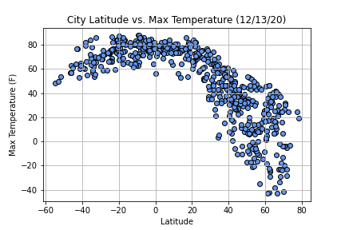
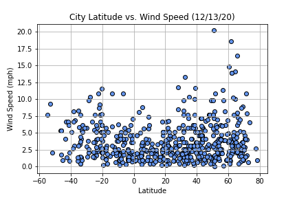
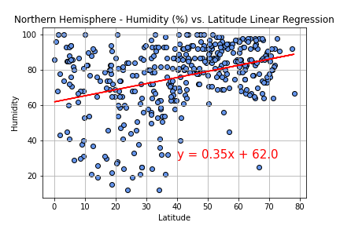
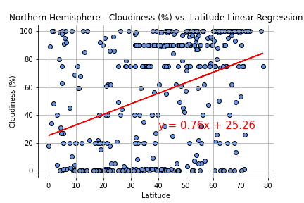
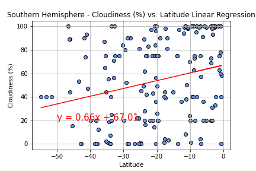
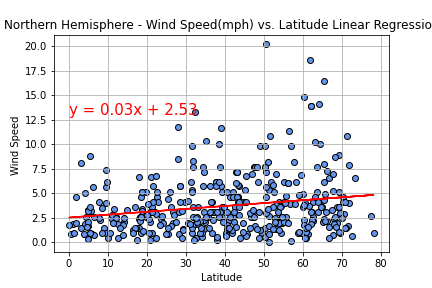

# Python API Homework - What's the Weather Like?

## Part I - WeatherPyImages 

The task was to create a Python script to visualize the weather of 500+ cities across the world of varying distance from the equator. 

The first requirement was to create a series of scatter plots to showcase the following relationships:

The second requirement was to run linear regression on each relationship. This time, separate the plots into Northern Hemisphere (greater than or equal to 0 degrees latitude) and Southern Hemisphere (less than 0 degrees latitude):

  

  

My final [jupyter notebook](https://github.com/Kpearson72/python-api-challenge/blob/main/WeatherPy/WeatherPy.ipynb) included:

* Randomly selected cities (at least 500) based on latitude and longitude.
* A weather check on each of the cities using a series of successive API calls.
* A print log of each city as it's being processed with the city number and city name.
* A saved [CSV](https://github.com/Kpearson72/python-api-challenge/blob/main/WeatherPy/output_data/city_df.csv) file of all retrieved data and a PNG image for each scatter plot.

### Part II - VacationPy

**Planning a future vacation**

I used jupyter-gmaps and Google Places API for this part of the assignment.

Tasks for this part of the project consisted of:

* Creating a heat map that displays the humidity for every city from Part I - WeatherPy

* Narrowing down the DataFrame to find my ideal weather condition. It had to have:

  * A max temperature lower than 80 degrees but higher than 70.

  * Wind speed less than 10 mph.

  * Zero cloudiness.

  * Dropped any rows that don't contain all three conditions. You want to be sure the weather is ideal.

* Using Google Places API to find the first hotel for each city located within 5000 meters of the cities coordinates.

* Plotting the hotels on top of the humidity heatmap with each pin containing the **Hotel Name**, **City**, and **Country**.

As a final consideration:

I completed my analysis using a Jupyter notebook. 
* [WeatherPy Notebook link](https://github.com/Kpearson72/python-api-challenge/blob/main/WeatherPy/WeatherPy.ipynb)
* [VacationPy Notebook link](https://github.com/Kpearson72/python-api-challenge/blob/main/VacationPy/VacationPy.ipynb)

